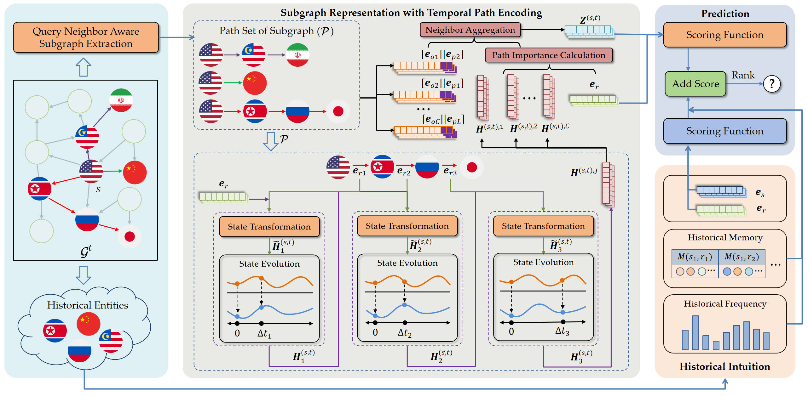

# AdaR: An Adaptive Temporal Knowledge Graph
Reasoning Model with Variable Time Granularity

## Introduction
**[submit to SIGIR 2025]** 

<p align="center">

</p>

## Authors

Yansong Liu, Rui liu, Yuan Zuo, Yong Chen, Xun Lin, Fuzhen Zhuang

## Requirements
- numba==0.54.1
- numpy==1.19.2
- pandas==1.2.2
- scikit_learn==1.1.1
- torch==1.7.1
- torchdiffeq==0.2.2
- tqdm==4.59.0

## Model training
 ```./run_icews14.sh```
 ```./run_icews05-15.sh```
 ```./run_gdelt.sh```
 ```./run_social_TKG.sh```

## Model Testing

default_weight and test_model_path need to be set according to yourself training situation

```python test.py -d ICEWS14 --n_degree 64 16 4 --pos_dim 60 --embed_dim 600 --temporal_bias 0.1 --solver rk4 --step_size 0.25 --bs 512 --gpu 0 --seed 0 --default_weight 0.3 --test_model_path your_model_path```

```python test.py -d ICEWS05_15 --n_degree 64 16 4 --pos_dim 60 --embed_dim 600 --temporal_bias 0.01 --solver rk4 --step_size 0.25 --bs 512 --gpu 0 --seed 0 --default_weight 0.3 --test_model_path your_model_path```

```python main.py -d GDELT --n_degree 64 16 4 --pos_dim 60 --embed_dim 600 --temporal_bias 0.001 --solver rk4 --step_size 0.25 --bs 512 --gpu 0 --seed 0 --default_weight 0.3 --test_model_path your_model_path```

```python main.py -d social_TKG --n_degree 64 16 4 --pos_dim 60 --embed_dim 600 --temporal_bias 1 --solver rk4 --step_size 0.25 --bs 512 --gpu 0 --seed 0 --default_weight 0.3 --test_model_path your_model_path```